# 8位CPU的逻辑电路

## 项目

### 文件结构

`main.circ` 为 Logisim Evolution 的项目文件；`main.CircuitProject` 为 LogicCircuit 的项目文件。

由于 Logisim Evolution 性能有瓶颈，所以 `main.circ` 只开发了一部分，其余转向了 `main.CircuitProject`。

### 参考

[8位CPU设计与实现B站视频](https://www.bilibili.com/video/BV1aP4y1s7Vf/?spm_id_from=333.999.0.0&vd_source=24924a2b6e399f6354bb051bd87d3bb1)

### 半加器

A、B 加数，S和，C进位

| A    | B    | S(Sum) | C(Carry) |
| ---- | ---- | ------ | -------- |
| 0    | 0    | 0      | 0        |
| 0    | 1    | 1      | 0        |
| 1    | 0    | 1      | 0        |
| 1    | 1    | 0      | 1        |

逻辑操作表达式：
$$
\begin{aligned}
    S =& \overline{A}B + A\overline{B} \\
    C =& AB
\end{aligned}
$$

逻辑电路

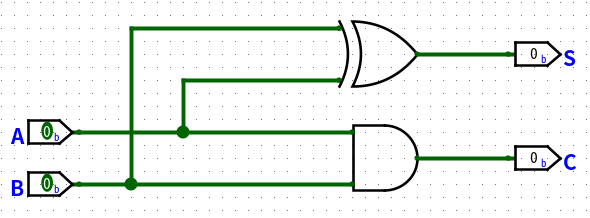

### 全加器

A、B 加数，S和，CO进位输出，CI接受上个全加器的CO。

| A    | B    | CI(Cin) | Sum  | CO(Cout) |
| ---- | ---- | ------- | ---- | -------- |
| 0    | 0    | 0       | 0    | 0        |
| 0    | 0    | 1       | 1    | 0        |
| 0    | 1    | 0       | 1    | 0        |
| 0    | 1    | 1       | 0    | 1        |
| 1    | 0    | 0       | 1    | 0        |
| 1    | 0    | 1       | 0    | 1        |
| 1    | 1    | 0       | 0    | 1        |
| 1    | 1    | 1       | 1    | 1        |

逻辑电路

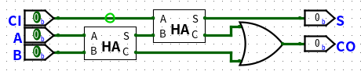

### 八位加法器

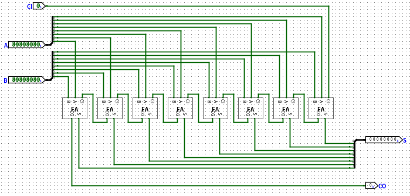

补充：

减法操作是加法的拓展，A-B等于A+B补码。补码为反码+1。此外溢出位如果为1则表示整数（因为减数小，所以补码大），反之则为负数。

### R-S flip-flop

R（Reset）S（Set）触发器（AKA. S-R flip-flop）。RS触发器设计使其能够在一定条件下锁存（或保持）输入信号。

| S(Set) | R(Reset) | Q    | Q'   |
| ------ | -------- | ---- | ---- |
| 0      | 0        | keey | keey |
| 1      | 0        | 1    | 0    |
| 0      | 1        | 0    | 1    |
| 1      | 1        | 无效 | 无效 |

逻辑电路

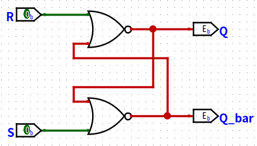

实际的电路

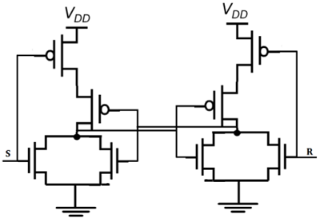

### D flip-flot

由于上述R-S真值表的有无用的选项（00和11）。因此D触发器（Data flipflop）使用D输入控制存储的内容。

逻辑电路：

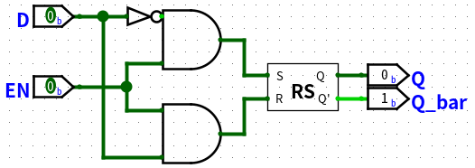

### D> flipflop

考虑到在CPU中，其状态受到时钟控制，设计一个时钟上升沿的D触发器，即D>触发器。

逻辑电路：

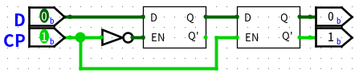

### improved S-R flipflop

由于上述SR触发器逻辑电路对于Q的状态仅有RS控制，因此新增可以将Q预设1的Preset和将Q清零的Clear。方便后续D和D>的改进。

增强的逻辑电路

逻辑电路

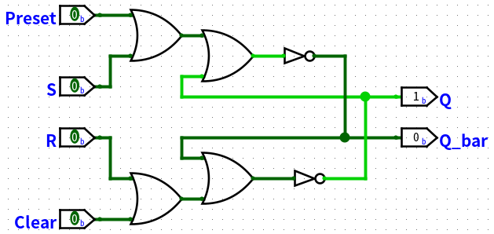

### improved D flipflop

同理

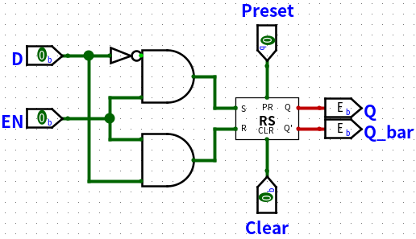

### improved D> flipflop

同理

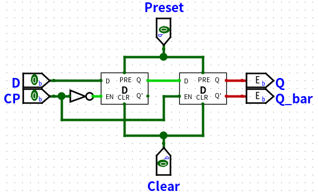

### T> flipflop

Toggle flipflop T触发器

逻辑电路

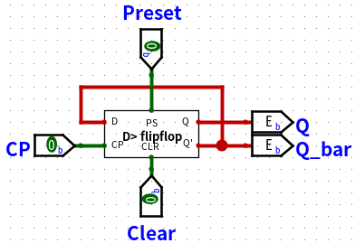

### Ripple Counter

行波计数器

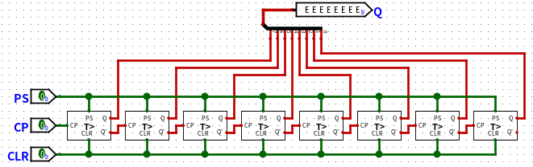

### Byte

创建一个能维持1byte状态的电路，为寄存器作准备。

逻辑电路

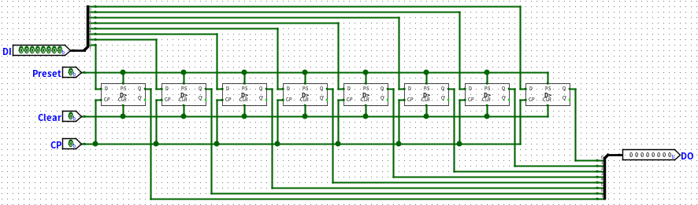

### 8 bit tri-status gate

我们创建一个8位的三台门控制器，为寄存器作准备。

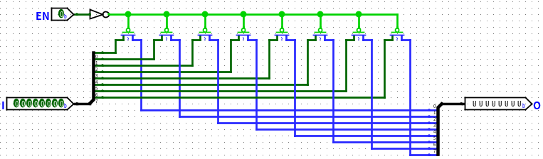

### Byte Register

使用8个D>触发器和8位三态门组成的具有读写控制的寄存器！

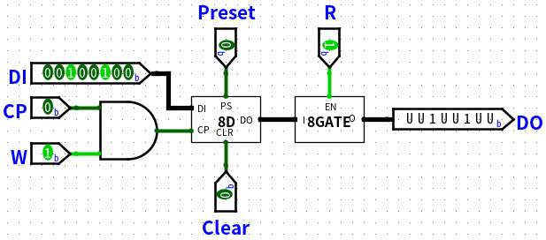

### 3 to 8 Decoder

上述完成了单个的寄存器，现在我们要完成8Byte的寄存器，需要用3-8译码器，即用三位操控8位，二的三次方。

逻辑电路：

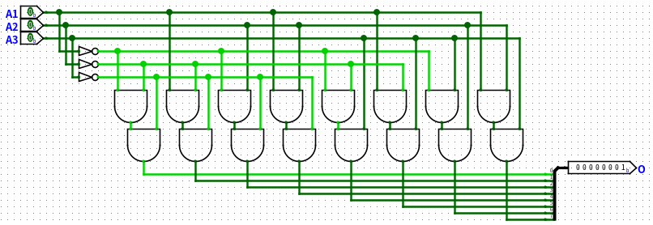

### 8 Byte register

通过三八译码器可以对指定的寄存器进行读和写操作。

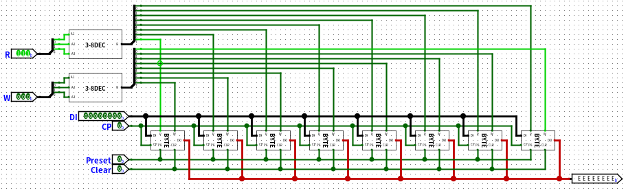

### 8 Byte register - 位拓展

逻辑电路

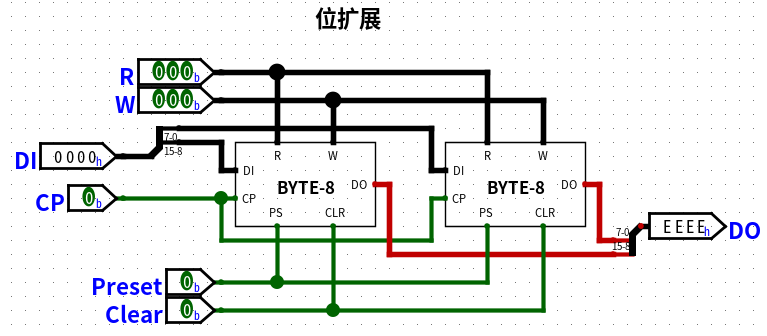

**由于Logisim Evolution性能受限，接下来的操作将使用Logsim！**

### 8 Byte register - 字拓展

